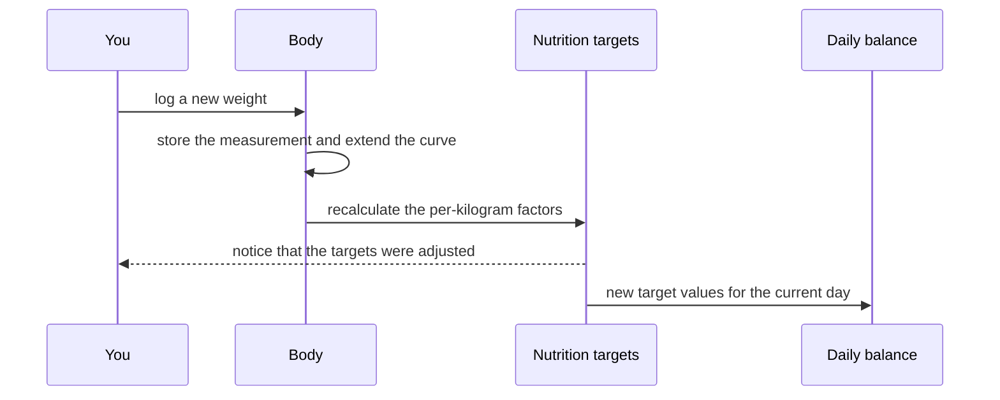

[Back to the manual]({{ "/en/manual/" | relative_url }}) · [Deutsche Version]({{ "/handbuch/koerper/" | relative_url }})

# Body

## What this chapter is for

The body area records two measurements over time: **weight** and **waist**. It is deliberately small. Its purpose is not to survey your body but to give you a line in which a development becomes visible — and to supply the one value the nutrition targets need.

You reach it through the quick add button in the middle of the bottom bar, or through the body tile on the [dashboard]({{ "/en/manual/dashboard/" | relative_url }}).

## Logging a measurement

An entry needs a date, a time and **at least one of the two values**. If all you did was step on the scale, enter the weight alone; the waist stays empty and tears no hole in the curve. You can add a note — "morning, before breakfast" is a different number from "evening, after dinner", and in six months you will not remember which was which.

Whether you type kilograms and centimetres or pounds and inches is decided by the unit system in your [profile]({{ "/en/manual/getting-started/" | relative_url }}). Storage is always metric, so you can switch at any time without an old measurement changing.

## The two charts

Weight and waist each get **their own chart with their own scale**. That is on purpose: in a single picture the weight curve would flatten the waist curve, because the two numbers live in entirely different orders of magnitude. Kept apart, each curve stays comparable to itself.

Above the charts you choose the period — week, month or year. Each chart can also be opened full screen and sideways, where there is more room for the detail.

Curves need points: a single measurement does not make a chart. After the second or third one it becomes a line.

## Why weight lives here and not in the profile

In the profile your weight is now only a note pointing here. The reason is simple: a single value in the profile cannot show a development, and it would have to be maintained by hand. Here every weight is a point in time, and the most recent one counts as current.

From that follows a convenience: **every newly logged weight recalculates your macro targets**, provided you set them via grams per kilogram of body weight. The app briefly tells you it has done so. You do not need to open the targets screen for it.

*Model type: UML sequence diagram — what a single weight entry sets off.*

## The history

Below the charts the measurements are listed. Individual entries can be deleted, for instance when you mistyped. Exactly that measurement goes; the others stay, and the curve closes over the gap.

## When something does not work

- **"Not enough data for a chart yet."** There is only one measurement so far. From the second one on you get a line.
- **The targets do not follow the weight.** Then they are not set via grams per kilogram but entered as fixed numbers. Fixed values are deliberately left alone.
- **The numbers look wrong.** Check the unit system in your profile — pounds and kilograms look the same in a chart but are not the same size.

## How it fits together

The weight from here feeds the targets under [Nutrition]({{ "/en/manual/nutrition/" | relative_url }}) and the body tile on the [dashboard]({{ "/en/manual/dashboard/" | relative_url }}). Every measurement also makes the day an active one and so counts towards your streak in the [log]({{ "/en/manual/diary/" | relative_url }}).
