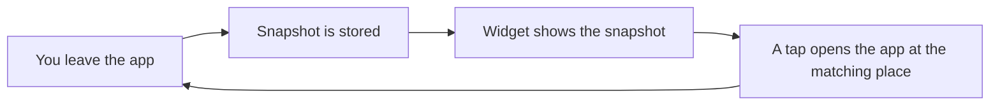

[Back to the manual]({{ "/en/manual/" | relative_url }}) · [Deutsche Version]({{ "/handbuch/dashboard/" | relative_url }})

# Dashboard and widget

## What this chapter is for

The dashboard is the app's calculating room. It enters nothing and changes nothing; it gathers what came out of [Training]({{ "/en/manual/training/" | relative_url }}), [Nutrition]({{ "/en/manual/nutrition/" | relative_url }}), [Body]({{ "/en/manual/body/" | relative_url }}) and the [log]({{ "/en/manual/diary/" | relative_url }}) — across a week, a month or a year. You reach it through the dashboard tile on the start screen.

## The period decides everything

At the very top you choose between **week**, **month** and **year**. That choice applies to the whole page: every number below refers to the selected period, not to "all time".

Which days make up a week depends on the *start of the week* setting — Monday or Sunday. It affects this summary only, not your appointments in the planner.

And one peculiarity that is not a malfunction: **on the first day of a week there is nothing to compare.** The dashboard says so rather than drawing a line through a single point. From the third day on, the numbers carry a trend.

## What you find there

| Area | What it answers |
|---|---|
| **Active days** | On how many days of the period anything happened at all — and what |
| **Streak** | How many days in a row you were active |
| **Volume** | How much weight you moved in total during the period |
| **Nutrition** | Intake per day against your target, and your rhythm |
| **Macro trend** | How protein, carbs and fat develop across the days |
| **Strength** | Your development across the exercises |
| **Records** | Your personal bests and when they fell |
| **Body** | Weight and waist with their change over the period |

The strength, records and body areas only appear once there is something to show. An empty dashboard with eight zeros would not be a report but a reproach.

**Active days count more than workouts.** A day is active when anything happened in the app — a session, a meal, a body measurement, a journal moment. That is why the app has exactly **one** streak, and it counts every kind of activity rather than finished workouts alone.

## The rhythm

The nutrition area shows something no other part of the app shows: **when** you eat. How long before training your last meal was, how quickly the next one followed, how large the gaps between meals were on average, when the day starts and stops being a day of eating.

This analysis lives on the times of your entries. If you log your lunch in the evening, correct the time there — otherwise the rhythm will claim you ate five meals after eight at night.

## The macro trend

The curve of the three macronutrients can be read in two ways:

- **In grams.** Each nutrient gets its own dashed limit in its own colour. Above the line means above target.
- **In percent.** Each nutrient is drawn as a share of its *own* target. 100 means exactly on target — which makes nutrients comparable whose numbers otherwise have nothing to do with each other.

Calories are never a line but red bars: 2200 against 150 grams of protein in one picture would flatten every other curve. The red bars show by how many calories you went over your target that day.

The chart can be enlarged and opened sideways in full screen. Two fingers zoom, one finger drags through your history.

## The home screen widget (iOS)

Sparta Island ships a widget you can put on your iPhone's home screen. It is called **Quick access** and it does two things.

It **shows** your streak and the calories you have left today. And it **opens** the app at four places directly: start a workout, scan food, log a meal, weight and size.

A widget does not calculate anything itself. It reads a snapshot the app has left for it — written every time you leave the app and every time you come back. That is precisely the right moment, because a widget is only ever looked at while the app is closed. It is also why the widget prints how old its snapshot is. If a number looks stale: open the app briefly and close it again.

*That is why the widget is current although it computes nothing itself.*

## When something does not work

- **An area is missing.** It appears as soon as the matching data exists — body, for instance, after your first measurement.
- **"Not enough data to compare."** A comparison needs two periods. After the second month the yearly comparison says more.
- **The week looks wrongly cut.** Check the start of the week under Options.
- **The widget shows old numbers.** Open the app once; on leaving it writes the new snapshot.

## How it fits together

The dashboard is where all the other chapters end up. It is also the way to **exercise progress**, which shows every single exercise as a curve — described in the [Training]({{ "/en/manual/training/" | relative_url }}) chapter.
