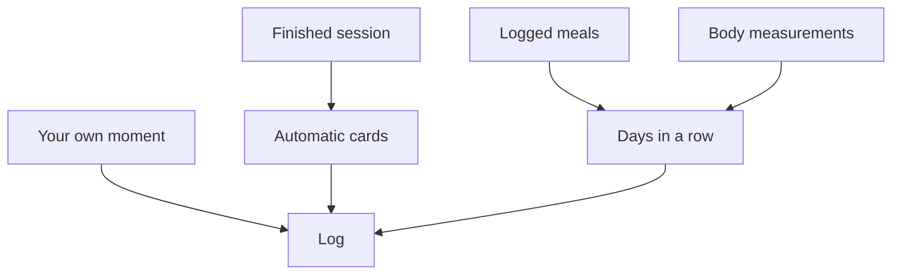

[Back to the manual]({{ "/en/manual/" | relative_url }}) · [Deutsche Version]({{ "/handbuch/tagebuch/" | relative_url }})

# Log and journal

## What this chapter is for

The **Log** area — the fourth entry in the bottom bar — is the story of your training. It does not answer "how much", that is the [dashboard's]({{ "/en/manual/dashboard/" | relative_url }}) job, but "what happened". Two kinds of content sit there side by side: what the app worked out from your data, and what you recorded yourself.

## The bars at the top

Above everything sits a bar chart of the last fourteen days. Taller bars mean more sets and more weight moved on that day. It is deliberately short: it is meant to show whether things are moving right now, not to tell the story of the year.

## Cards that appear on their own

Below it are cards nobody enters. The app creates them when something happens:

| Card | When it appears |
|---|---|
| Personal record | You moved more weight in an exercise than ever before |
| Rep record | Never before that many reps in a single set |
| Monthly balance | The month has been added up |
| Days in a row | Your streak of active days hit a mark |
| Milestone | Your tenth, fiftieth, hundredth workout |
| Lifetime volume | What you have moved in total since day one |
| Comeback | You were away for a while and came back |
| Muscle focus | Which muscle was at the centre this month |
| Got stronger | Your improvement in a particular exercise |
| Best week | More sessions than in any week before |
| Early bird | Sessions before eight in the morning |
| Monthly recap | The month gone by, in one card |

You can share these cards if you like — they are designed for it. None of it happens automatically: only what you hand over yourself ever leaves the device.

## Your own moments

Next to the calculated part sits what no number captures. A moment consists of a note, optionally a photo or video, and a feeling. You can pick media from your library, take a photo or record a video. Tapping it opens it full screen.

Moments are the reason the log is more than a statistic: why a session went well is in no curve.

## Deleting — and what that does

Moments are removed right on the card. For a training entry the app asks more precisely, because two different things can be meant:

- **Remove from the log only** — the card disappears, your sets stay in records and training history.
- **Remove from the records too** — the logged sets go as well and no longer count towards records and statistics.

The second choice is the right one when you mistyped. The first, when only the card is in the way.

*The streak counts every kind of activity in the app, not only finished workouts — a logged meal or a body measurement makes the day active too.*

## When something does not work

- **The log is empty.** It fills up with your first finished workout. Before that there is nothing to tell.
- **A photo cannot be picked.** Permission for the media library is missing; you can grant it in your system settings.
- **Images are missing after an import.** A backup contains the media, but it can leave files out when they were too large or no longer on the device. The report after the import tells you how many are affected.

## How it fits together

The cards grow out of [Training]({{ "/en/manual/training/" | relative_url }}), the streak additionally out of [Nutrition]({{ "/en/manual/nutrition/" | relative_url }}) and [Body]({{ "/en/manual/body/" | relative_url }}). The quickest way to add a new moment is the quick add button in the middle of the bottom bar.
