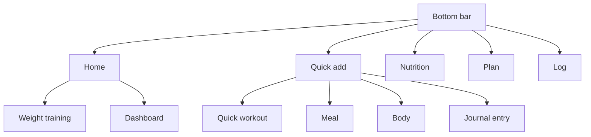

[Back to the manual]({{ "/en/manual/" | relative_url }}) · [Deutsche Version]({{ "/handbuch/erste-schritte/" | relative_url }})

# Getting started

## What this chapter is for

Sparta Island has five areas that all look at the same data: training, nutrition, planner, log and body. Once the layout makes sense, everything else follows on its own. This chapter explains that layout, your profile, the settings — and what happens to your data.

## The first launch

The very first time you open the app, it asks in both languages whether you want to use it in German or English. The question is deliberately bilingual, because at that moment nobody knows yet which language you read. Your choice applies immediately and can be changed at any time under *Options*.

After that the app sits there empty. That is intentional: there is no sample data, no demo user and no pre-built training week. The first entry you see is yours.

## How the app is laid out

At the bottom sits a bar with four destinations and a round button in the middle.

| Destination | What happens there | Chapter |
|---|---|---|
| **Home** | Start screen: your personal bests, the way into training, your next planned session | this one |
| **Nutrition** | The day with everything you ate | [Nutrition]({{ "/en/manual/nutrition/" | relative_url }}) |
| **Plan** | Calendar of the sessions still ahead | [Planner]({{ "/en/manual/planner/" | relative_url }}) |
| **Log** | What happened: cards, records and your own moments | [Log and journal]({{ "/en/manual/diary/" | relative_url }}) |
| **Round button** | Quick add — quick workout, meal, body weight, journal entry | — |

The quick add button in the middle is the shortcut for everything that happens in passing: you want to train *now*, you have *just* eaten, you are *standing* on the scale. It drops you straight where you can enter the value instead of making you navigate there. The *Health* entry is already visible but not yet filled in — it is reserved for later values such as blood pressure and pulse.

From the start screen two further areas are reachable as tiles: **Weight training** leads to your workouts, **Dashboard** to the numbers across longer periods. The body area sits behind the quick add button and behind the body tile on the dashboard.

## The tours

Most screens carry a question mark at the top. It starts a short tour showing where things are on *that* screen. The tours are the faster route to operating the app; this manual explains how the screens relate to each other instead. You can replay any tour as often as you like — it only remembers whether it has appeared by itself once on your first visit.

## Your profile

The profile holds your name, height, birthday, gender and activity level. None of it is mandatory, but it has a job: from these values the app estimates your daily calorie need, which you can adopt in the nutrition targets with a single tap.

Two things matter there:

- **The unit system** — metric or imperial — only switches the display. Everything is stored in kilograms and centimetres, so you can switch back and forth without a single one of your numbers changing.
- **Your weight** is not entered in the profile but under [Body]({{ "/en/manual/body/" | relative_url }}). There it is a history rather than a single value, and that history is exactly what the analyses need.

## The settings

*Options* holds four groups:

- **Colour palette and display mode** — several palettes plus light, dark or following the system.
- **Start of the week** — Monday or Sunday. The setting only decides which days the dashboard treats as "this week". Your plans and appointments do not move.
- **Language** — German or English, switchable at any time.
- **Data** — export, import and full deletion.

## Your data

Everything stays on the device. There is no account, no server and no transfer of your entries. That has a downside worth knowing: **if you delete the app, the data is gone.** A backup exists only if you make one.

That is what the export is for. It writes your entries, the media of your journal moments and your display settings into a file you can store or pass on. The import reads such a file back in — **it adds to what is there and never overwrites**. Entries that already exist are skipped.

Two things leave the device, and only these:

- **The barcode scan** asks Open Food Facts for a product's nutrition facts. What is sent is the barcode number, nothing else.
- **Sharing** a log card or a workout summary — but only when you trigger it yourself.

The camera is used only while you scan or take a photo for a journal moment. The full explanation is in the [privacy policy]({{ "/en/privacy/" | relative_url }}).

## How it fits together

The profile feeds the calorie estimate in [Nutrition]({{ "/en/manual/nutrition/" | relative_url }}), the start of the week shapes the [Dashboard]({{ "/en/manual/dashboard/" | relative_url }}), and your weight comes from [Body]({{ "/en/manual/body/" | relative_url }}). For most people the next step is [Training]({{ "/en/manual/training/" | relative_url }}).
