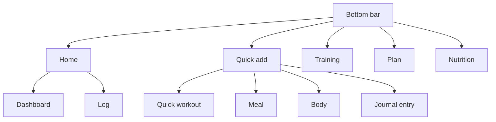

[Back to the manual]({{ "/en/manual/" | relative_url }}) · [Deutsche Version]({{ "/handbuch/erste-schritte/" | relative_url }})

# Getting started

## What this chapter is for

Sparta Island has five areas that all look at the same data: training, nutrition, planner, log and body. Once the layout makes sense, everything else follows on its own. This chapter explains that layout, your profile, the settings — and what happens to your data.

## The first launch

The very first time you open the app, it asks four questions on one screen: your language, your units, how dates and times are written, and which day your week starts on. The heading is deliberately bilingual, because at that moment nobody knows yet which language you read.

Every answer takes effect immediately, and **every one of them is a starting point, not a commitment** — all four live under *Options* afterwards and can be changed at any time. The app guesses nothing from the country your phone is in: it would rather ask once than assume.

If you used the app before this version, you see the questions once after the update, with what you already had preselected. Confirming is enough; everything then stays as it was.

After that the app sits there empty. That is intentional: there is no sample data, no demo user and no pre-built training week. The first entry you see is yours.

## How the app is laid out

At the bottom sits a bar with four destinations and a round button in the middle.

| Destination | What happens there | Chapter |
|---|---|---|
| **Home** | Start screen: your personal bests, the way into training, your next planned session | this one |
| **Training** | Your workouts: create, change, start | [Training]({{ "/en/manual/training/" | relative_url }}) |
| **Plan** | Calendar of the sessions still ahead | [Planner]({{ "/en/manual/planner/" | relative_url }}) |
| **Nutrition** | The day with everything you ate | [Nutrition]({{ "/en/manual/nutrition/" | relative_url }}) |
| **Round button** | Quick add — quick workout, meal, body weight, journal entry | — |

The quick add button in the middle is the shortcut for everything that happens in passing: you want to train *now*, you have *just* eaten, you are *standing* on the scale. It drops you straight where you can enter the value instead of making you navigate there. The *Health* entry is already visible but not yet filled in — it is reserved for later values such as blood pressure and pulse.

From the start screen two further areas are reachable as tiles: **Dashboard** leads to the numbers across longer periods, **Log** to what already happened. The body area sits behind the quick add button and behind the body tile on the dashboard.

Training only got its place in the bar late: it is the core of the app, yet it was the one large area without a fixed spot at the bottom. The log moved up to the start screen in exchange.

## The tours

Most screens carry a question mark at the top. It starts a short tour showing where things are on *that* screen. The tours are the faster route to operating the app; this manual explains how the screens relate to each other instead. You can replay any tour as often as you like — it only remembers whether it has appeared by itself once on your first visit.

## Your profile

The profile holds your name, height, birthday, gender and activity level. None of it is mandatory, but it has a job: from these values the app estimates your daily calorie need, which you can adopt in the nutrition targets with a single tap.

One thing matters there: **your weight** is not entered in the profile but under [Body]({{ "/en/manual/body/" | relative_url }}). There it is a history rather than a single value, and that history is exactly what the analyses need.

Units have left the profile and now sit with the other settings — they apply to the whole app, not just to the two numbers in the profile.

## The settings

*Options* holds six groups:

- **Colour palette and display mode** — several palettes plus light, dark or following the system.
- **Language** — German or English, switchable at any time.
- **Units** — kilograms and centimetres, or pounds and feet. Applies to training weights, body measurements and food amounts.
- **Date and time** — the day-first spelling with a 24-hour clock, or the American one with the month first and AM/PM.
- **Start of the week** — Monday or Sunday. The setting only decides which days the dashboard treats as "this week". Your plans and appointments do not move.
- **Data** — export, import and full deletion.

The first four do **not** depend on each other. English with day-first dates is a perfectly sensible combination, German with pounds just as much, and switching the language changes neither your units nor your date format.

## Why switching changes nothing

All three switches change **how** your numbers are written, never which numbers they are. Internally the app always counts in kilograms, centimetres, grams and millilitres, and it stores moments without a format. What you read is made from that only at the moment it is shown.

That applies backwards too: switch to pounds today and last year's record reads in pounds, and yesterday's log entry shows its date the new way. And because nothing is rewritten, switching back lands you on exactly the number you entered — 173 cm are 5′8″ and then 173 cm again, not 172.7.

There is one exception, and it is not really one: what you type **in** pounds or inches is converted when it is saved. That one is your own entry.

Below them sit privacy and the cloud account that does not exist yet. Both used to be on the start screen; they do not answer the question of where you stand right now, and so they live with the rest of the settings. The consent asked on the very first start stays where it was.

## Your data

Your entries stay on the device. There is no account, no server of our own and no transfer of your entries. That has a downside worth knowing: **if you delete the app, the data is gone.** A backup exists only if you make one.

That is what the export is for. It writes your entries, the media of your journal moments and your display settings into a file you can store or pass on. The import reads such a file back in — **it adds to what is there and never overwrites**. Entries that already exist are skipped.

Two things leave the device, and only these:

- **The barcode scan** asks Open Food Facts for a product's nutrition facts. What is sent is the barcode number and, for technical reasons, your IP address and an app identifier — never the camera image ([privacy]({{ "/en/privacy/" | relative_url }})).
- **Sharing** a log card or a workout summary — but only when you trigger it yourself.

The camera is used only while you scan or take a photo for a journal moment. The full explanation is in the [privacy policy]({{ "/en/privacy/" | relative_url }}).

## How it fits together

The profile feeds the calorie estimate in [Nutrition]({{ "/en/manual/nutrition/" | relative_url }}), the start of the week shapes the [Dashboard]({{ "/en/manual/dashboard/" | relative_url }}), and your weight comes from [Body]({{ "/en/manual/body/" | relative_url }}). For most people the next step is [Training]({{ "/en/manual/training/" | relative_url }}).
