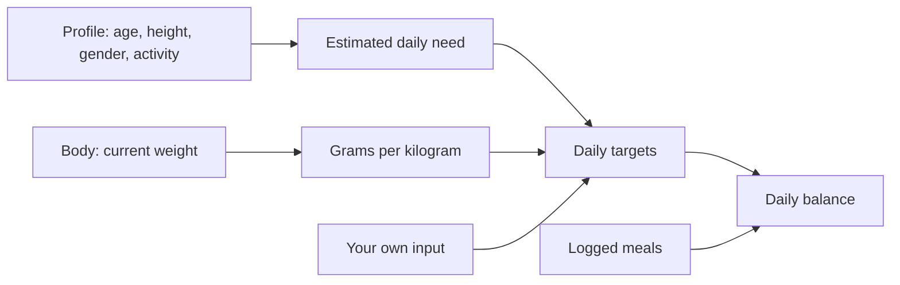

[Back to the manual]({{ "/en/manual/" | relative_url }}) · [Deutsche Version]({{ "/handbuch/ernaehrung/" | relative_url }})

# Nutrition

## What this chapter is for

The nutrition screen is a **day**, not a diary. It always shows exactly one calendar day with everything you ate and holds it against your targets. Anything that spans several days lives on the [dashboard]({{ "/en/manual/dashboard/" | relative_url }}).

## The day

The date sits at the top. Swipe left and right to move between days, and one tap brings you back to today. Below it is the balance: the day's calories plus protein, carbs and fat, each against your target.

The meals are listed underneath in the order you entered them. Each one is stamped with a time — the time of entry. If you log your lunch in the evening, correct the time right on the entry. This is not cosmetics: from those times the dashboard later works out your rhythm — when you eat your first meal, how long the gaps are, how your meals sit around training.

## Planned and eaten

An entry can be one of two things: **eaten** or **planned**. Planned items do not count towards the day's balance yet; they sit in their own section with their own total. That way you can work out in the morning whether the day still adds up with the dinner you have in mind — the app tells you when the plan takes you past your daily target. Later you tick the planned entry off as eaten instead of entering it again.

## Logging something

There are three ways to record a food:

| Way | What for |
|---|---|
| **Search** | Everything you have logged before, plus the bundled foods |
| **Scan a barcode** | Packaged products |
| **Enter manually** | Home cooking and everything without a barcode |

Whichever way you take, you finish by giving the amount — **in millilitres for a drink, in grams for anything else**. Which of the two applies is decided by the food and not by you: a cola is poured, a steak is weighed, and 100 ml of oil weigh 92 g. When you scan a product, the app takes that straight from it.

Every nutrition value refers to 100 g or 100 ml respectively; the amount scales it down or up.

If you switched to pounds and feet under *Options*, you enter the amount in ounces and fluid ounces. **The nutrition values themselves stay in grams** — protein, carbohydrates and fat are given in grams on American packaging too.

### The barcode scan

The scan looks on your device first. If the app does not know the product, it asks Open Food Facts — and only the barcode number leaves your phone in the process. The product it finds is stored locally and is there instantly next time, offline included.

Two cases need you:

- **Nobody knows the product.** Then you create it yourself — typed once, stored for good.
- **The figures are wrong.** Then correct them. Your corrected values take precedence. Should Open Food Facts learn about the product later, the app asks whether to replace your values with the new ones — it never does so on its own.

A food of your own can be created with both a German and an English name. It then shows up under the right name in either language.

## Your targets

You set the targets yourself, and there are three ways to get there:

1. **By hand.** Enter calories and the three macronutrients, done.
2. **From your profile.** The app estimates your daily need with the Mifflin-St Jeor formula from age, height, weight, gender and activity level. One tap adopts the value. It remains an estimate — a calculation, not a measurement.
3. **Via grams per kilogram of body weight.** You pick a pattern as your starting point — muscle gain, fat loss or maintenance — and the app converts the factors against your current weight into grams.

The third way has a property that saves you work: **when your weight changes, the targets change with it.** Log a new weight under [Body]({{ "/en/manual/body/" | relative_url }}) and the macro targets are recalculated without you opening the targets screen again. Without a stored weight this way does not work — you are then left with the factors and no gram totals.

On top of that you set a **macro focus**: the nutrient that matters most to you. It decides what gets emphasised on the daily screen.

*The targets have three sources, but only one applies: the one saved last.*

## When something does not work

- **The scanner does not open.** Camera permission is missing. You can grant it in your phone's system settings.
- **The product is not found.** Open Food Facts is an open database; not every product is in it, and regional goods often are not. Create it once yourself — after that your app knows it.
- **The nutrition facts look wrong.** They come out of the database exactly as somebody entered them there. Correct them on the product; the correction sticks.
- **The day is empty although you logged something.** The date at the top is probably on another day. Jumping back to today is one tap.

## How it fits together

The [profile]({{ "/en/manual/getting-started/" | relative_url }}) supplies the need estimate, [Body]({{ "/en/manual/body/" | relative_url }}) the weight for the grams-per-kilogram calculation, and the [dashboard]({{ "/en/manual/dashboard/" | relative_url }}) gathers the days into weeks, months and years.
