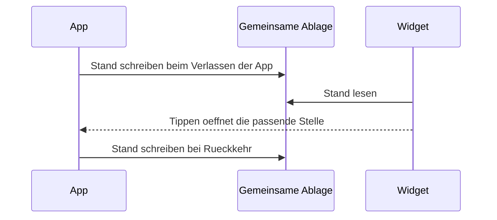

[Zurück zum Handbuch]({{ "/handbuch/" | relative_url }}) · [English version]({{ "/en/manual/dashboard/" | relative_url }})

# Dashboard und Widget

## Wofür dieses Kapitel da ist

Das Dashboard ist die Rechenstelle der App. Es trägt nichts ein und ändert nichts; es fasst zusammen, was in [Training]({{ "/handbuch/training/" | relative_url }}), [Ernährung]({{ "/handbuch/ernaehrung/" | relative_url }}), [Körper]({{ "/handbuch/koerper/" | relative_url }}) und [Verlauf]({{ "/handbuch/tagebuch/" | relative_url }}) entstanden ist — über eine Woche, einen Monat oder ein Jahr. Du erreichst es über die Dashboard-Kachel auf der Startseite.

## Der Zeitraum entscheidet alles

Ganz oben wählst du zwischen **Woche**, **Monat** und **Jahr**. Diese Wahl gilt für die ganze Seite: Jede Zahl darunter bezieht sich auf den gewählten Zeitraum, nicht auf „immer".

Welche Tage eine Woche umfasst, hängt von der Einstellung *Wochenbeginn* ab — Montag oder Sonntag. Sie betrifft nur diese Zusammenfassung, nicht deine Termine im Planer.

Und eine Eigenheit, die keine Fehlfunktion ist: **Am ersten Tag einer Woche gibt es nichts zu vergleichen.** Das Dashboard schreibt das hin, statt eine Linie durch einen einzigen Punkt zu ziehen. Ab dem dritten Tag tragen die Zahlen einen Trend.

## Was dort steht

| Bereich | Was er beantwortet |
|---|---|
| **Aktive Tage** | An wie vielen Tagen des Zeitraums überhaupt etwas passiert ist — und was |
| **Serie** | Wie viele Tage in Folge du aktiv warst |
| **Volumen** | Wie viel Gewicht du im Zeitraum insgesamt bewegt hast |
| **Ernährung** | Aufnahme pro Tag gegen dein Ziel, und dein Rhythmus |
| **Makro-Trend** | Wie sich Protein, Kohlenhydrate und Fett über die Tage entwickeln |
| **Kraft** | Deine Entwicklung über die Übungen hinweg |
| **Rekorde** | Die Bestleistungen und wann sie fielen |
| **Körper** | Gewicht und Taille mit ihrer Veränderung im Zeitraum |

Die Kraft-, Rekord- und Körper-Bereiche erscheinen erst, wenn es etwas zu zeigen gibt. Ein leeres Dashboard mit acht Nullen wäre kein Bericht, sondern eine Aufforderung.

**Aktive Tage zählen mehr als Workouts.** Ein Tag ist aktiv, wenn irgendetwas in der App passiert ist — ein Training, eine Mahlzeit, ein Körpermaß, ein Tagebuchmoment. Deshalb steht in der App genau **eine** Serie, und sie zählt jede Bewegung, nicht nur beendete Workouts.

## Der Rhythmus

Der Ernährungsbereich zeigt etwas, das keine andere Stelle der App zeigt: **wann** du isst. Wie lange vor dem Training die letzte Mahlzeit lag, wie schnell danach die nächste kam, wie groß die Abstände zwischen den Mahlzeiten im Schnitt waren, wann der Tag anfängt und aufhört zu essen.

Diese Auswertung lebt von den Uhrzeiten deiner Einträge. Wenn du abends nachträgst, was du mittags gegessen hast, korrigiere dort die Uhrzeit — sonst behauptet der Rhythmus, du hättest fünf Mahlzeiten nach acht Uhr abends gegessen.

## Der Makro-Trend

Die Kurve der drei Makronährstoffe lässt sich auf zwei Arten lesen:

- **In Gramm.** Jeder Nährstoff bekommt seine eigene gestrichelte Grenze in seiner eigenen Farbe. Über der Linie heißt: über dem Ziel.
- **In Prozent.** Jeder Nährstoff wird als Anteil seines *eigenen* Ziels gezeichnet. 100 heißt genau getroffen — so lassen sich Nährstoffe vergleichen, deren Zahlen sonst nichts miteinander zu tun haben.

Kalorien sind nie eine Linie, sondern rote Balken: 2200 gegen 150 Gramm Protein in einem Bild würde jede andere Kurve flach drücken. Die roten Balken zeigen, um wie viele Kalorien du an diesem Tag über deinem Ziel lagst.

Das Diagramm lässt sich vergrößern und quer im Vollbild öffnen. Mit zwei Fingern zoomst du, mit einem ziehst du durch deine Geschichte.

## Das Widget auf dem Startbildschirm (iOS)

Sparta Island bringt ein Widget mit, das du auf den Startbildschirm deines iPhones legen kannst. Es heißt **Schnellzugriff** und hat zwei Aufgaben.

Es **zeigt** deine Serie und die Kalorien, die dir heute noch bleiben. Und es **öffnet** die App an vier Stellen direkt: Workout starten, Essen scannen, Essen eintragen, Gewicht und Umfang.

Ein Widget rechnet nicht selbst. Es liest einen Stand, den die App hinterlegt hat — immer dann, wenn du die App verlässt oder zu ihr zurückkehrst. Genau das ist der richtige Moment, denn angeschaut wird ein Widget nur, während die App geschlossen ist. Deshalb steht auf dem Widget auch dazu, von wann sein Stand ist. Erscheint dir eine Zahl veraltet: App kurz öffnen und wieder schließen.

*Modelltyp: UML-Sequenzdiagramm — warum das Widget aktuell ist, obwohl es nichts berechnet.*

## Wenn etwas nicht klappt

- **Ein Bereich fehlt.** Er erscheint, sobald die zugehörigen Daten da sind — Körper etwa nach der ersten Messung.
- **„Nicht genug Daten für einen Vergleich."** Ein Vergleich braucht zwei Zeiträume. Nach dem zweiten Monat sagt der Jahresvergleich mehr.
- **Die Woche wirkt falsch abgegrenzt.** Prüfe den Wochenbeginn in den Optionen.
- **Das Widget zeigt alte Zahlen.** Öffne die App einmal; beim Verlassen schreibt sie den neuen Stand.

## Zusammenspiel

Das Dashboard ist der Endpunkt aller anderen Kapitel. Es ist auch der Weg zum **Übungsfortschritt**, der jede einzelne Übung als Kurve zeigt — beschrieben im Kapitel [Training]({{ "/handbuch/training/" | relative_url }}).
