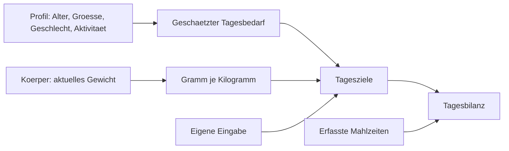

[Zurück zum Handbuch]({{ "/handbuch/" | relative_url }}) · [English version]({{ "/en/manual/nutrition/" | relative_url }})

# Ernährung

## Wofür dieses Kapitel da ist

Die Ernährungsseite ist ein **Tag**, kein Tagebuch. Sie zeigt immer genau einen Kalendertag mit allem, was du gegessen hast, und stellt ihn deinen Zielen gegenüber. Alles, was über mehrere Tage geht, findest du im [Dashboard]({{ "/handbuch/dashboard/" | relative_url }}).

## Der Tag

Oben steht das Datum. Du wischst nach links und rechts, um zwischen den Tagen zu wechseln, und kommst mit einem Tippen zurück zu heute. Darunter liegt die Bilanz: die Kalorien des Tages sowie Protein, Kohlenhydrate und Fett, jeweils gegen dein Ziel.

Die Mahlzeiten stehen darunter in der Reihenfolge, in der du sie eingetragen hast. Jede bekommt automatisch eine Uhrzeit — die des Eintragens. Wenn du erst abends nachträgst, was du mittags gegessen hast, korrigierst du die Uhrzeit direkt am Eintrag. Das ist keine Kosmetik: Aus diesen Zeiten berechnet das Dashboard später deinen Rhythmus — wann du die erste Mahlzeit isst, wie lange die Abstände sind, wie sich das Essen um dein Training legt.

## Geplant und gegessen

Ein Eintrag kann zweierlei sein: **gegessen** oder **geplant**. Geplantes zählt noch nicht in die Tagesbilanz, sondern steht in einem eigenen Abschnitt mit eigener Summe. So kannst du morgens durchrechnen, ob der Tag mit dem geplanten Abendessen noch aufgeht — die App sagt dir, wenn der Plan über dein Tagesziel hinausführt. Später hakst du den geplanten Eintrag als gegessen ab, statt ihn neu zu erfassen.

## Etwas eintragen

Es gibt drei Wege, ein Lebensmittel zu erfassen:

| Weg | Wofür |
|---|---|
| **Suche** | Alles, was du schon einmal erfasst hast, und die mitgelieferten Lebensmittel |
| **Barcode scannen** | Verpackte Produkte |
| **Manuell eingeben** | Selbstgekochtes und alles ohne Barcode |

Unabhängig vom Weg gibst du am Ende die Menge **in Gramm** an. Alle Nährwerte in der App sind auf 100 g bezogen; die Menge rechnet sie herunter oder hoch.

### Der Barcode-Scan

Der Scan sucht zuerst auf deinem Gerät. Kennt die App das Produkt nicht, fragt sie bei Open Food Facts nach — dabei verlässt nur die Barcode-Nummer dein Telefon. Das gefundene Produkt wird lokal gespeichert und ist beim nächsten Mal sofort da, auch offline.

Zwei Fälle brauchen dich:

- **Das Produkt ist nirgends bekannt.** Dann legst du es selbst an — einmal getippt, für immer gespeichert.
- **Die Angaben stimmen nicht.** Dann korrigierst du sie. Deine korrigierten Werte haben Vorrang. Sollte Open Food Facts das Produkt später doch kennen, fragt die App, ob sie deine Werte durch die neuen ersetzen soll — von selbst tut sie es nicht.

Ein eigenes Lebensmittel kannst du mit deutschem und englischem Namen anlegen. Es taucht dann in beiden Sprachen unter dem richtigen Namen auf.

## Deine Ziele

Die Ziele setzt du selbst, und du kommst auf drei Wegen dorthin:

1. **Von Hand.** Kalorien und die drei Makronährstoffe eintragen, fertig.
2. **Aus dem Profil.** Die App schätzt deinen Tagesbedarf nach der Mifflin-St-Jeor-Formel aus Alter, Größe, Gewicht, Geschlecht und Aktivitätslevel. Ein Tippen übernimmt den Wert. Es bleibt eine Schätzung — ein Rechenweg, keine Messung.
3. **Über Gramm je Kilogramm Körpergewicht.** Du wählst ein Muster als Ausgangspunkt — Muskelaufbau, Fettabbau oder Erhalt — und die App rechnet die Faktoren gegen dein aktuelles Gewicht in Gramm um.

Der dritte Weg hat eine Eigenschaft, die dir Arbeit spart: **Wenn sich dein Gewicht ändert, ändern sich die Zielwerte mit.** Trägst du im [Körper]({{ "/handbuch/koerper/" | relative_url }}) ein neues Gewicht ein, werden die Makroziele neu gerechnet, ohne dass du die Zielseite noch einmal öffnen musst. Ohne hinterlegtes Gewicht funktioniert dieser Weg nicht — dann bleibt es bei den Faktoren ohne Gramm-Angabe.

Zusätzlich legst du einen **Makro-Fokus** fest: den Nährstoff, auf den es dir vor allem ankommt. Er entscheidet, was auf der Tagesseite hervorgehoben wird.

*Die Ziele haben drei Quellen, aber nur eine gilt: die zuletzt gespeicherte.*

## Wenn etwas nicht klappt

- **Der Scanner öffnet sich nicht.** Die Kamerafreigabe fehlt. Sie lässt sich in den Systemeinstellungen deines Telefons nachholen.
- **Das Produkt wird nicht gefunden.** Open Food Facts ist eine offene Datenbank; nicht jedes Produkt steht dort, und regionale Ware oft nicht. Leg es einmal selbst an — danach kennt deine App es.
- **Die Nährwerte wirken falsch.** Sie kommen so aus der Datenbank, wie jemand sie dort eingetragen hat. Korrigiere sie am Produkt; die Korrektur bleibt.
- **Der Tag ist leer, obwohl du etwas eingetragen hast.** Vermutlich steht das Datum oben auf einem anderen Tag. Der Sprung zurück zu heute ist ein Tippen.

## Zusammenspiel

Das [Profil]({{ "/handbuch/erste-schritte/" | relative_url }}) liefert die Bedarfsschätzung, der [Körper]({{ "/handbuch/koerper/" | relative_url }}) das Gewicht für die Gramm-je-Kilogramm-Rechnung, und das [Dashboard]({{ "/handbuch/dashboard/" | relative_url }}) fasst die Tage zu Wochen, Monaten und Jahren zusammen.
