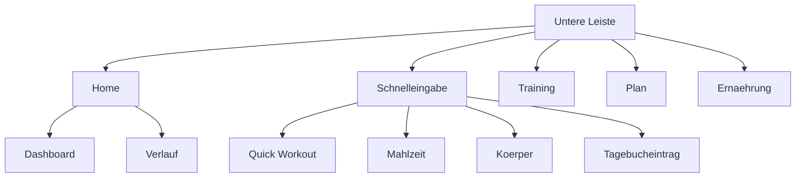

[Zurück zum Handbuch]({{ "/handbuch/" | relative_url }}) · [English version]({{ "/en/manual/getting-started/" | relative_url }})

# Erste Schritte

## Wofür dieses Kapitel da ist

Sparta Island besteht aus fünf Bereichen, die alle auf dieselben Daten schauen: Training, Ernährung, Planer, Verlauf und Körper. Wer die Aufteilung einmal verstanden hat, findet danach alles Weitere von selbst. Dieses Kapitel erklärt den Aufbau, das Profil, die Einstellungen — und was mit deinen Daten geschieht.

## Der erste Start

Beim allerersten Öffnen stellt die App vier Fragen auf einem Bild: die Sprache, die Einheiten, die Schreibweise von Datum und Uhrzeit und den Wochenbeginn. Die Überschrift steht bewusst zweisprachig da, weil zu diesem Zeitpunkt noch niemand weiß, welche Sprache du liest.

Jede Antwort gilt sofort und **jede ist eine Voreinstellung, keine Festlegung** — alle vier stehen später unter *Optionen* und lassen sich jederzeit ändern. Die App rät dabei nichts aus dem Land, in dem dein Telefon steht: Sie fragt lieber einmal, als etwas anzunehmen.

Wenn du die App schon vor dieser Version benutzt hast, siehst du die Fragen nach dem Update einmal — mit dem, was du bisher hattest, bereits ausgewählt. Bestätigen genügt; dann bleibt alles, wie es war.

Danach steht die App leer vor dir. Das ist beabsichtigt: Es gibt keine Beispieldaten, keinen Musternutzer und keine vorgefertigte Trainingswoche. Der erste Eintrag, den du siehst, ist deiner.

## So ist die App aufgebaut

Unten liegt eine Leiste mit vier Zielen und einer runden Schaltfläche in der Mitte.

| Ziel | Was dort passiert | Kapitel |
|---|---|---|
| **Home** | Startseite: deine Bestleistungen, der Einstieg ins Training, die nächste geplante Einheit | dieses |
| **Training** | Deine Workouts: anlegen, ändern, starten | [Training]({{ "/handbuch/training/" | relative_url }}) |
| **Plan** | Kalender mit den Einheiten, die noch kommen | [Planer]({{ "/handbuch/planner/" | relative_url }}) |
| **Ernährung** | Der Tag mit allem, was du gegessen hast | [Ernährung]({{ "/handbuch/ernaehrung/" | relative_url }}) |
| **Runde Schaltfläche** | Schnelleingabe — Quick Workout, Mahlzeit, Körpergewicht, Tagebucheintrag | — |

Die Schnelleingabe in der Mitte ist die Abkürzung für alles, was zwischendurch passiert: Du willst *jetzt* trainieren, hast *gerade* gegessen, stehst *eben* auf der Waage. Sie bringt dich direkt an die Stelle, an der du eintragen kannst, statt dich erst durch die Bereiche navigieren zu lassen. Der Eintrag *Gesundheit* ist dort bereits sichtbar, aber noch nicht belegt — er ist für spätere Werte wie Blutdruck und Puls vorgesehen.

Von der Startseite aus erreichst du zwei weitere Bereiche als Kacheln: **Dashboard** führt zu den Zahlen über längere Zeiträume, **Verlauf** zu dem, was war. Der Körper-Bereich liegt hinter der Schnelleingabe und hinter der Körper-Kachel im Dashboard.

Das Training hat die Leiste erst spät bekommen — es ist der Kern der App, war aber der einzige große Bereich ohne festen Platz unten. Dafür ist der Verlauf auf die Startseite gerückt.

## Die Touren

Auf den meisten Bildschirmen sitzt oben ein Fragezeichen. Es startet eine kurze Tour, die dir zeigt, wo auf *diesem* Bildschirm was liegt. Die Touren sind der schnellere Weg zur Bedienung; dieses Handbuch erklärt dafür die Zusammenhänge zwischen den Bildschirmen. Du kannst jede Tour beliebig oft wieder aufrufen — sie merkt sich nur, ob sie beim ersten Besuch schon einmal von selbst erschienen ist.

## Dein Profil

Im Profil stehen Name, Größe, Geburtstag, Geschlecht und dein Aktivitätslevel. Diese Angaben sind keine Pflicht, aber sie haben eine Aufgabe: Aus ihnen berechnet die App deinen geschätzten Tagesbedarf an Kalorien, den du in den Ernährungszielen mit einem Tippen übernehmen kannst.

Eines ist dort wichtig: **Dein Gewicht** trägst du nicht im Profil ein, sondern im Bereich [Körper]({{ "/handbuch/koerper/" | relative_url }}). Dort ist es ein Verlauf statt eines einzelnen Werts, und genau diesen Verlauf brauchen die Auswertungen.

Die Einheiten haben das Profil verlassen und stehen jetzt bei den übrigen Einstellungen — sie gelten für die ganze App, nicht nur für die zwei Zahlen im Profil.

## Die Einstellungen

Unter *Optionen* liegen sechs Gruppen:

- **Farbschema und Anzeigemodus** — mehrere Paletten sowie hell, dunkel oder der Systemvorgabe folgend.
- **Sprache** — Deutsch oder Englisch, jederzeit umschaltbar.
- **Einheiten** — Kilogramm und Zentimeter, oder Pfund und Fuß. Gilt für Trainingsgewichte, Körpermaße und die Mengen beim Essen.
- **Datum und Uhrzeit** — die deutsche Schreibweise mit 24-Stunden-Uhr, oder die amerikanische mit Monat zuerst und AM/PM.
- **Wochenbeginn** — Montag oder Sonntag. Die Einstellung entscheidet nur, welche Tage das Dashboard als „diese Woche" zusammenfasst. Deine Pläne und Termine verschieben sich dadurch nicht.
- **Daten** — Export, Import und das vollständige Löschen.

Die ersten vier hängen **nicht** voneinander ab. Englisch mit deutschem Datum ist eine sinnvolle Kombination, Deutsch mit Pfund ebenso, und wer die Sprache wechselt, ändert damit weder seine Einheiten noch sein Datumsformat.

## Warum ein Wechsel nichts verändert

Alle drei Umschalter ändern nur, **wie** deine Zahlen dastehen — nie, welche Zahlen es sind. Die App rechnet intern immer in Kilogramm, Zentimetern, Gramm und Millilitern und speichert Zeitpunkte ohne Format. Erst beim Anzeigen entsteht daraus, was du liest.

Das gilt auch rückwirkend: Stellst du heute auf Pfund um, erscheint auch dein Rekord vom letzten Jahr in Pfund, und ein Tagebucheintrag von gestern zeigt sein Datum in der neuen Schreibweise. Und weil nichts umgeschrieben wird, kommst du beim Zurückschalten wieder bei genau der Zahl an, die du eingetragen hattest — 173 cm sind 5′8″ und danach wieder 173 cm, nicht 172,7.

Eine Ausnahme gibt es, und sie ist keine: Was du **in** Pfund oder Zoll einträgst, wird beim Speichern umgerechnet. Das ist dann deine eigene Eingabe.

Darunter stehen der Datenschutz und das Cloud-Konto, das noch nicht da ist. Beide lagen früher auf der Startseite; sie beantworten aber nicht die Frage, wo du gerade stehst, und stehen deshalb bei den übrigen Einstellungen. Die Zustimmung beim allerersten Start bleibt, wo sie war.

## Deine Daten

Alles bleibt auf dem Gerät. Es gibt kein Konto, keinen Server und keine Übertragung deiner Einträge. Das hat eine Kehrseite, die du kennen solltest: **Wenn du die App löschst, sind die Daten weg.** Ein Backup gibt es nur, wenn du es selbst anlegst.

Dafür ist der Export da. Er schreibt deine Einträge, die Medien deiner Tagebuchmomente und deine Anzeigeeinstellungen in eine Datei, die du speichern oder weitergeben kannst. Der Import liest so eine Datei wieder ein — **er ergänzt, was da ist, und überschreibt nie**. Einträge, die es schon gibt, werden übersprungen.

Zwei Stellen verlassen das Gerät, und nur diese:

- **Der Barcode-Scan** fragt bei Open Food Facts nach den Nährwerten eines Produkts. Übertragen wird die Nummer des Barcodes, sonst nichts.
- **Das Teilen** einer Verlaufskarte oder einer Trainingszusammenfassung — aber nur, wenn du es selbst auslöst.

Die Kamera wird ausschließlich benutzt, während du scannst oder ein Foto für einen Tagebuchmoment aufnimmst. Die vollständige Erklärung steht in der [Datenschutzerklärung]({{ "/datenschutz/" | relative_url }}).

## Zusammenspiel

Das Profil liefert die Grundlage für die Kalorienschätzung in der [Ernährung]({{ "/handbuch/ernaehrung/" | relative_url }}), der Wochenbeginn prägt das [Dashboard]({{ "/handbuch/dashboard/" | relative_url }}), und dein Gewicht kommt aus dem [Körper]({{ "/handbuch/koerper/" | relative_url }}). Der nächste Schritt für die meisten ist das [Training]({{ "/handbuch/training/" | relative_url }}).
