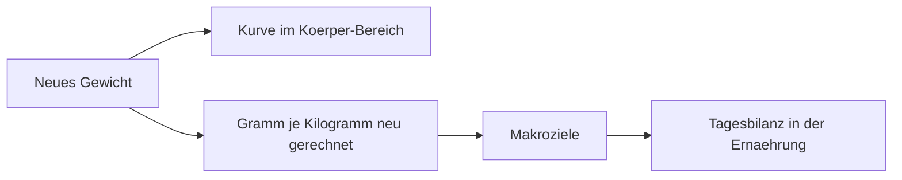

[Zurück zum Handbuch]({{ "/handbuch/" | relative_url }}) · [English version]({{ "/en/manual/body/" | relative_url }})

# Körper

## Wofür dieses Kapitel da ist

Der Körper-Bereich hält zwei Maße über die Zeit fest: **Gewicht** und **Taillenumfang**. Er ist bewusst klein gehalten. Sein Zweck ist nicht, den Körper zu vermessen, sondern eine Linie zu haben, an der du eine Entwicklung erkennst — und den einen Wert zu liefern, den die Ernährungsziele brauchen.

Du erreichst ihn über die Schnelleingabe in der Mitte der unteren Leiste oder über die Körper-Kachel im [Dashboard]({{ "/handbuch/dashboard/" | relative_url }}).

## Eine Messung eintragen

Ein Eintrag braucht Datum, Uhrzeit und **mindestens einen der beiden Werte**. Hast du nur gewogen, trägst du nur das Gewicht ein; die Taille bleibt leer und reißt keine Lücke in die Kurve. Eine Notiz kannst du dazuschreiben — „morgens nüchtern" ist eine andere Zahl als „abends nach dem Essen", und in einem halben Jahr weißt du das nicht mehr.

Ob du in Kilogramm und Zentimetern oder in Pfund und Zoll eingibst, entscheidet das Einheitensystem in deinem [Profil]({{ "/handbuch/erste-schritte/" | relative_url }}). Gespeichert wird immer metrisch, deshalb kannst du jederzeit umschalten, ohne dass eine alte Messung sich ändert.

## Die beiden Diagramme

Gewicht und Taille bekommen **je ein eigenes Diagramm mit eigener Skala**. Das ist Absicht: Zusammen in einem Bild würde die Gewichtskurve die Taillenkurve plattdrücken, weil beide Zahlen in ganz verschiedenen Größenordnungen liegen. Getrennt bleibt jede Kurve mit sich selbst vergleichbar.

Über den Diagrammen wählst du den Zeitraum — Woche, Monat oder Jahr. Jedes Diagramm lässt sich außerdem im Vollbild und quer öffnen, wo mehr Platz für die Details ist.

Kurven brauchen Punkte: Aus einer einzigen Messung entsteht noch kein Diagramm. Nach der zweiten oder dritten wird eine Linie daraus.

## Warum das Gewicht hier steht und nicht im Profil

Im Profil steht dein Gewicht nur noch als Hinweis mit einem Verweis hierher. Der Grund ist einfach: Ein einzelner Wert im Profil kann keine Entwicklung zeigen, und er müsste von Hand gepflegt werden. Hier ist jedes Gewicht ein Zeitpunkt, und der jeweils jüngste gilt als der aktuelle.

Daraus folgt eine Bequemlichkeit: **Jedes neu eingetragene Gewicht rechnet deine Makroziele neu**, sofern du sie über Gramm je Kilogramm Körpergewicht eingestellt hast. Die App sagt dir kurz, dass sie das getan hat. Du musst die Zielseite dafür nicht öffnen.

*Ein einziger Eintrag wirkt an drei Stellen.*

## Die Historie

Unter den Diagrammen stehen die Messungen als Liste. Einzelne Einträge lassen sich löschen, etwa wenn du dich vertippt hast. Gelöscht wird genau diese Messung; die anderen bleiben, und die Kurve schließt sich über die Lücke.

## Wenn etwas nicht klappt

- **„Noch nicht genug Daten für ein Diagramm."** Es gibt erst eine Messung. Ab der zweiten entsteht eine Linie.
- **Die Ziele ändern sich nicht mit dem Gewicht.** Dann sind sie nicht über Gramm je Kilogramm eingestellt, sondern fest eingetragen. Feste Werte lässt die App bewusst in Ruhe.
- **Die Zahlen sehen falsch aus.** Prüfe das Einheitensystem im Profil — Pfund und Kilogramm sehen im Diagramm gleich aus, sind aber verschieden groß.

## Zusammenspiel

Das Gewicht von hier speist die Ziele in der [Ernährung]({{ "/handbuch/ernaehrung/" | relative_url }}) und die Körper-Kachel im [Dashboard]({{ "/handbuch/dashboard/" | relative_url }}). Jede Messung macht außerdem den Tag zu einem aktiven Tag und zählt damit für deine Serie im [Verlauf]({{ "/handbuch/tagebuch/" | relative_url }}).
