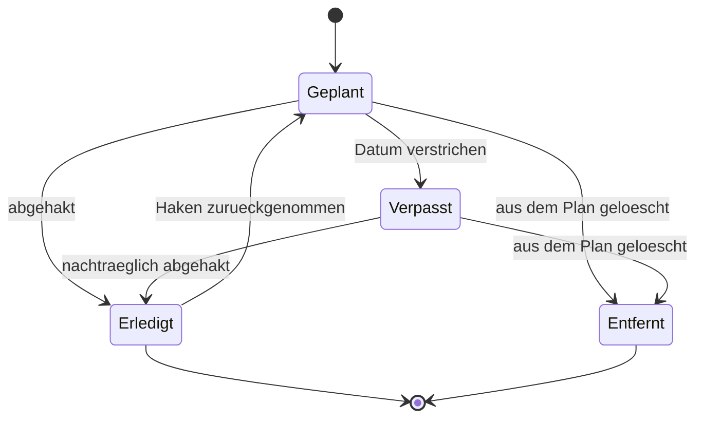

[Zurück zum Handbuch]({{ "/handbuch/" | relative_url }}) · [English version]({{ "/en/manual/planner/" | relative_url }})

# Planer

## Wofür dieses Kapitel da ist

Der Planer ist die einzige Stelle der App, die **nach vorn** schaut. Alles andere hält fest, was war. Hier legst du fest, was kommen soll — und siehst hinterher, ob es auch passiert ist.

Der Planer ist freiwillig. Du kannst die App vollständig nutzen, ohne je einen Termin anzulegen; dann bleibt sie ein Protokoll. Wer sich an eine Woche binden will, findet hier den Rahmen dafür.

## Der Kalender

Es gibt zwei Ansichten: die **Woche** mit ihren sieben Tagen und den **Monat** als Übersicht. Punkte an den Tagen zeigen den Zustand — geplant, erledigt, oder an diesem Tag wurde trainiert. Ein Tippen auf einen Tag zeigt darunter dessen Einträge.

Für jeden Eintrag siehst du auf einen Blick, wie er zu heute steht: heute fällig, fällig in einigen Tagen, verpasst, oder zuletzt erledigt an einem bestimmten Tag. Das ist die eigentliche Aufgabe des Planers — nicht der Kalender, sondern der Abstand zwischen Vorsatz und Wirklichkeit.

## Eine Einheit planen

Ein Eintrag braucht wenig: einen Namen und ein Datum. Zwei Dinge kannst du zusätzlich angeben.

**Ein verknüpftes Workout.** Verknüpfst du den Termin mit einem deiner Workouts, kannst du es am Trainingstag direkt aus dem Eintrag heraus öffnen und starten. Ohne Verknüpfung bleibt der Eintrag eine Notiz — auch das ist zulässig, etwa für Schwimmen oder eine Laufrunde, die die App nicht protokolliert.

**Eine Wiederholung.** Statt jeden Termin einzeln anzulegen, wählst du ein Muster:

| Muster | Bedeutung |
|---|---|
| Keine | Ein einzelner Termin |
| Wöchentlich | Jede Woche am selben Wochentag |
| Alle zwei Wochen | Jede zweite Woche am selben Wochentag |
| Monatlich nach Datum | Immer am selben Tag im Monat, etwa am Dritten |
| Monatlich nach Wochentag | Etwa „jeder erste Montag" |

Die beiden monatlichen Muster sind nicht dasselbe: Der Dritte fällt jeden Monat auf einen anderen Wochentag, der erste Montag jeden Monat auf ein anderes Datum. Welches passt, hängt davon ab, wonach du dich richtest — dem Kalender oder deiner Woche.

## Abhaken und aufräumen

Erledigte Einheiten hakst du ab; ein Haken lässt sich auch wieder zurücknehmen. Wiederkehrende Einträge sind an einem eigenen Symbol erkennbar.

Beim Löschen einer wiederkehrenden Einheit fragt die App, was gemeint ist:

- **Nur diesen Termin löschen** — die Serie läuft weiter, dieser eine Tag fällt aus.
- **Diesen und alle künftigen löschen** — die Serie endet hier, die Vergangenheit bleibt stehen.

Wichtig, und beabsichtigt: **Ein gelöschter Termin nimmt nichts mit.** Weder dein Workout noch die Sätze, die du an diesem Tag trainiert hast, verschwinden dadurch. Der Planer verwaltet Vorsätze, nicht Trainingsdaten.

*Die Trainingsdaten kommen in diesem Diagramm nicht vor — sie hängen an der Einheit, nicht am Termin.*

## Wenn etwas nicht klappt

- **Beim Planen ist kein Workout zur Auswahl.** Dann gibt es noch keins. Leg zuerst eines im [Training]({{ "/handbuch/training/" | relative_url }}) an; danach steht es hier zur Verknüpfung bereit.
- **Ein Termin steht auf einem Tag, an dem du nicht kannst.** Verschieben ist kein eigener Vorgang: Bei einer Serie löschst du den einzelnen Termin und legst den Ersatz an, bei einem Einzeltermin änderst du ihn direkt.

## Zusammenspiel

Verknüpfte Workouts kommen aus dem [Training]({{ "/handbuch/training/" | relative_url }}). Deine nächste geplante Einheit erscheint auf der Startseite, damit du sie siehst, ohne den Planer zu öffnen. Ob du in einer Woche wirklich trainiert hast, beantwortet nicht der Planer, sondern das [Dashboard]({{ "/handbuch/dashboard/" | relative_url }}).
