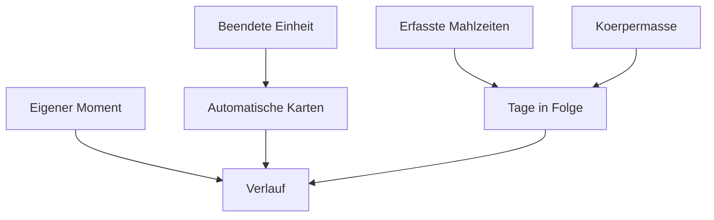

[Zurück zum Handbuch]({{ "/handbuch/" | relative_url }}) · [English version]({{ "/en/manual/diary/" | relative_url }})

# Verlauf und Tagebuch

## Wofür dieses Kapitel da ist

Der Bereich **Verlauf** — der vierte Eintrag in der unteren Leiste — ist die Erzählung deines Trainings. Er beantwortet nicht „wie viel", das tut das [Dashboard]({{ "/handbuch/dashboard/" | relative_url }}), sondern „was ist passiert". Zwei Sorten Inhalt stehen dort nebeneinander: was die App aus deinen Daten errechnet hat, und was du selbst festgehalten hast.

## Die Balken oben

Über allem liegt ein Balkendiagramm der letzten vierzehn Tage. Höhere Balken bedeuten mehr Sätze und mehr bewegtes Gewicht an diesem Tag. Es ist bewusst kurz gehalten: Es soll zeigen, ob gerade Bewegung drin ist, nicht die Geschichte des Jahres.

## Karten, die von selbst entstehen

Darunter liegen Karten, die niemand einträgt. Die App erzeugt sie, wenn ein Ereignis eintritt:

| Karte | Wann sie erscheint |
|---|---|
| Persönlicher Rekord | Du hast in einer Übung mehr Gewicht bewegt als je zuvor |
| Wiederholungsrekord | So viele Wiederholungen in einem Satz gab es noch nie |
| Monatsbilanz | Der Monat ist zusammengerechnet |
| Tage in Folge | Deine Serie aktiver Tage hat eine Marke erreicht |
| Meilenstein | Dein zehntes, fünfzigstes, hundertstes Workout |
| Gesamtvolumen | Was du seit dem ersten Tag insgesamt bewegt hast |
| Comeback | Du warst länger weg und bist zurück |
| Muskelfokus | Welcher Muskel diesen Monat im Mittelpunkt stand |
| Stärker geworden | Deine Steigerung in einer bestimmten Übung |
| Beste Woche | Mehr Einheiten als in jeder Woche davor |
| Frühaufsteher | Einheiten vor acht Uhr morgens |
| Monatsrückblick | Der zurückliegende Monat in einer Karte |

Diese Karten kannst du teilen, wenn du magst — sie sind dafür gestaltet. Nichts davon geschieht automatisch: Geteilt wird nur, was du selbst herausgibst.

## Deine eigenen Momente

Neben dem Errechneten steht das, was keine Zahl abbildet. Ein Moment besteht aus einer Notiz, wahlweise einem Foto oder Video, und einem Gefühl. Du kannst ein Medium aus deiner Mediathek wählen, ein Foto aufnehmen oder ein Video drehen. Angetippt öffnet es sich im Vollbild.

Momente sind der Grund, warum der Verlauf mehr ist als eine Statistik: Warum ein Training gut lief, steht in keiner Kurve.

## Löschen — und was dabei passiert

Momente entfernst du direkt an der Karte. Bei einem Trainingseintrag fragt die App genauer nach, weil zwei verschiedene Dinge gemeint sein können:

- **Nur aus dem Verlauf entfernen** — die Karte verschwindet, deine Sätze bleiben in Rekorden und Trainingshistorie.
- **Auch aus den Aufzeichnungen entfernen** — die protokollierten Sätze werden ebenfalls entfernt und zählen künftig nicht mehr für Rekorde und Statistiken.

Die zweite Wahl ist die richtige, wenn du dich vertippt hast. Die erste, wenn nur die Karte stört.

*Die Serie zählt jede Bewegung in der App, nicht nur beendete Workouts — auch eine erfasste Mahlzeit oder ein Körpermaß macht den Tag aktiv.*

## Wenn etwas nicht klappt

- **Der Verlauf ist leer.** Er füllt sich mit dem ersten beendeten Workout. Vorher gibt es nichts zu erzählen.
- **Ein Foto lässt sich nicht auswählen.** Die Freigabe für die Mediathek fehlt; sie lässt sich in den Systemeinstellungen nachholen.
- **Nach einem Import fehlen Bilder.** Eine Sicherung enthält die Medien, aber sie kann sie auslassen, wenn Dateien zu groß waren oder nicht mehr auf dem Gerät lagen. Der Bericht nach dem Import sagt, wie viele betroffen sind.

## Zusammenspiel

Die Karten entstehen aus dem [Training]({{ "/handbuch/training/" | relative_url }}), die Serie zusätzlich aus [Ernährung]({{ "/handbuch/ernaehrung/" | relative_url }}) und [Körper]({{ "/handbuch/koerper/" | relative_url }}). Einen neuen Moment legst du am schnellsten über die Schnelleingabe in der Mitte der unteren Leiste an.
